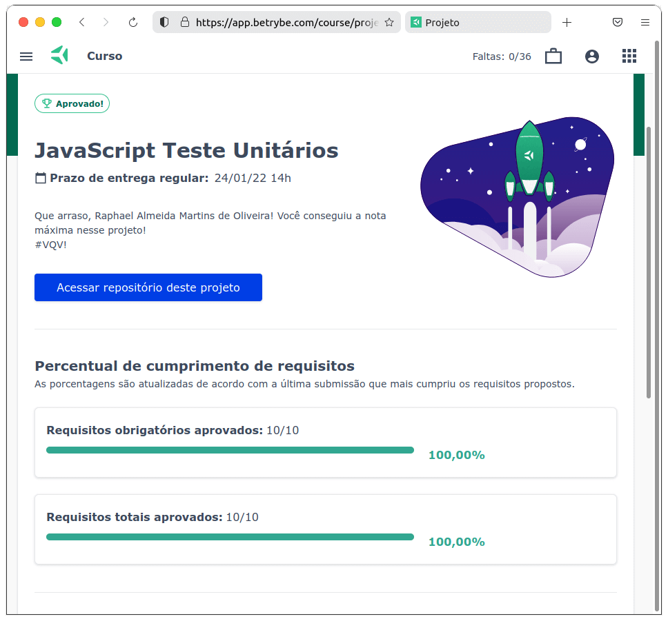

# :globe_with_meridians: JavaScript ES6 and Unit Tests :globe_with_meridians:

## :page_with_curl: About

Project of HTML, CSS, and JavaScript developed by me ([Raphael Martins](https://www.linkedin.com/in/raphaelameidamartins/)) at the end of the Unit 7 Module 1 of the [Trybe](https://www.betrybe.com)'s Web Development course. I was approved with 100% of the mandatory and optional requirements met.

We had to develop functions to solve programming logic challenges. We also had to develop unit tests to verify the functions' expected behavior by using the Jest framework. For functions that were already implemented, I had to develop the tests. And, for the tests that were already implemented, I had to develop the functions to be tested.

## :hammer_and_wrench: Tools

* JavaScript ES6+
* Jest

## :trophy: Grade

### :copyright: Copyright disclaimer

I developed this project for learning purposes, all the code and documentation texts in Portuguese and English are my authorship, except the ones that were already implemented and are marked with comments in the files. And the rights belong exclusively to me. It is allowed to download or clone the repository for study purposes. However, it is not allowed to publish full or partial copies. This disclaimer does not cover libraries and dependencies, which are subject to their respective licenses.
